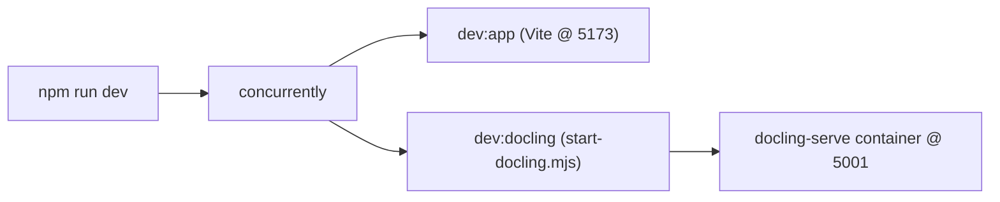

# PRP — Phase 17: Auto-start Docling Serve with the Dev Server

## Context

After Phase 15/16, document ingestion depends on a running **Docling Serve** instance. Today the developer has to start Docling separately (per `docs/DOCLING.md`) before `npm run dev` is useful for uploads. This is easy to forget — uploads then fail with "Could not reach Docling…".

This phase makes `npm run dev` **start Docling Serve automatically** alongside Vite, so a single command brings up everything needed to use the app. Docling runs as a container (Docker or Podman), matching `docs/DOCLING.md`. The setup degrades gracefully: if no container runtime is available, Vite still starts and the app runs (uploads just won't convert until Docling is available).



> Decision: use **`concurrently`** to run Vite + a small Node launcher in parallel. The launcher shells out to `docker`/`podman`. We do not use `concurrently -k` (kill-others), so a missing container runtime never takes down Vite.

---

## Changes: `package.json`

Add `concurrently` as a dev dependency and split the dev script:

```jsonc
"scripts": {
  "dev": "concurrently -n vite,docling -c cyan,green \"npm:dev:app\" \"npm:dev:docling\"",
  "dev:app": "vite",
  "dev:docling": "node scripts/start-docling.mjs",
  "docling:stop": "node scripts/start-docling.mjs --stop",
  "build": "tsc -b && vite build",
  "lint": "eslint .",
  "preview": "vite preview"
}
```

```bash
npm install --save-dev concurrently
```

- `dev:app` is the old `vite` script (so you can still run just the frontend).
- `dev` runs both with prefixed, colour-coded output.
- `docling:stop` is a convenience to stop the container started by the launcher.

---

## New file: `scripts/start-docling.mjs`

A small, cross-platform (macOS/Windows/Linux) Node ESM launcher. Responsibilities:
- Pick `docker` or `podman` (whichever is on PATH).
- If neither exists, print a friendly warning and **exit 0 after blocking** so `npm run dev` keeps Vite alive (no port noise, no crash).
- If a container named `he-tracker-docling` is already running, attach to its logs instead of starting a duplicate (avoids port 5001 conflicts on repeated `npm run dev`).
- Otherwise `run` the container with the same flags as `docs/DOCLING.md` (UI on, long sync wait, CORS for `http://localhost:5173`).
- On `SIGINT`/`SIGTERM`, stop the container so `--rm` cleans it up.
- Support `--stop` to stop/remove the container and exit.

```js
import { spawn, spawnSync } from 'node:child_process'

const CONTAINER = 'he-tracker-docling'
const IMAGE = 'quay.io/docling-project/docling-serve:latest'
const PORT = '5001'
const ORIGIN = 'http://localhost:5173'

function pickRuntime() {
  for (const rt of ['docker', 'podman']) {
    const r = spawnSync(rt, ['--version'], { stdio: 'ignore' })
    if (!r.error && r.status === 0) return rt
  }
  return null
}

function isRunning(rt) {
  const r = spawnSync(rt, ['ps', '--filter', `name=^${CONTAINER}$`, '--format', '{{.Names}}'], { encoding: 'utf8' })
  return r.stdout?.trim() === CONTAINER
}

function stopContainer(rt) {
  spawnSync(rt, ['stop', CONTAINER], { stdio: 'ignore' })
}

const rt = pickRuntime()
const stopMode = process.argv.includes('--stop')

if (!rt) {
  if (stopMode) process.exit(0)
  console.warn('[docling] No docker/podman found — skipping Docling. Uploads will not convert until Docling is running. See docs/DOCLING.md.')
  // Block so concurrently keeps Vite running; exit cleanly on signal.
  process.stdin.resume()
  process.on('SIGINT', () => process.exit(0))
  process.on('SIGTERM', () => process.exit(0))
} else if (stopMode) {
  stopContainer(rt)
  console.log(`[docling] Stopped ${CONTAINER}`)
  process.exit(0)
} else {
  const onSignal = () => { stopContainer(rt); process.exit(0) }
  process.on('SIGINT', onSignal)
  process.on('SIGTERM', onSignal)

  let child
  if (isRunning(rt)) {
    console.log(`[docling] ${CONTAINER} already running — attaching to logs.`)
    child = spawn(rt, ['logs', '-f', CONTAINER], { stdio: 'inherit' })
  } else {
    console.log(`[docling] Starting ${IMAGE} on http://localhost:${PORT} …`)
    child = spawn(rt, [
      'run', '--rm', '--name', CONTAINER,
      '-p', `${PORT}:5001`,
      '-e', 'DOCLING_SERVE_ENABLE_UI=1',
      '-e', 'DOCLING_SERVE_MAX_SYNC_WAIT=540',
      '-e', `DOCLING_SERVE_CORS_ORIGINS=["${ORIGIN}"]`,
      IMAGE,
    ], { stdio: 'inherit' })
  }
  child.on('exit', (code) => process.exit(code ?? 0))
}
```

> The `DOCLING_SERVE_CORS_ORIGINS` variable name can differ between `docling-serve` releases; if CORS still blocks the browser, follow the reverse-proxy fallback in `docs/DOCLING.md`. The launcher keeps the Docker command in one place so it stays in sync with the docs.

---

## Changes: `docs/DOCLING.md`

Add a short note at the top of "Start Docling Serve": running `npm run dev` now starts Docling automatically via `scripts/start-docling.mjs` (requires Docker or Podman installed and running; the first run pulls the image, which can take a few minutes). Keep the manual `docker run` instructions for users who prefer to run it standalone or who run only `npm run dev:app`.

---

## Files Modified

| File | Change |
|---|---|
| `package.json` | Add `concurrently` devDependency; split `dev` into `dev` + `dev:app` + `dev:docling`; add `docling:stop` |
| `scripts/start-docling.mjs` | New — container launcher (runtime detection, reuse-if-running, signal cleanup, `--stop`) |
| `docs/DOCLING.md` | Note that `npm run dev` auto-starts Docling; prerequisites |

No app source or schema changes.

---

## Verification

1. `npm install` succeeds and adds `concurrently`.
2. With Docker/Podman running: `npm run dev` brings up Vite (`http://localhost:5173`) and the Docling container; the `docling` prefixed logs show it listening on `5001`. Settings → Test Connection succeeds without any manual Docling start.
3. Upload a document — conversion works end to end.
4. Re-run `npm run dev` while a previous Docling container is still up — the launcher attaches to existing logs instead of failing on a port conflict.
5. Stop with Ctrl+C — the Docling container is stopped/removed (verify `docker ps` no longer lists `he-tracker-docling`); `npm run docling:stop` also stops it.
6. With Docker/Podman uninstalled or stopped: `npm run dev` still starts Vite, prints the "No docker/podman found" warning, and the app loads (uploads fail with the existing friendly Docling error until it's available).
7. `npm run dev:app` runs Vite only (no Docling), unchanged from before.
