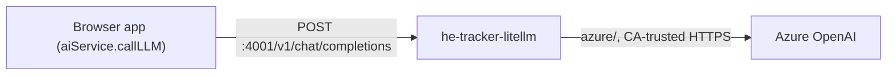

# PRP — Phase 18: Self-Hosted LiteLLM Container & Static Azure Config

## Context

Phase 14 added **LiteLLM** as a selectable AI provider, but the app relied on the **Polaris** project's LiteLLM proxy (`polaris-litellm` on port 4000). That coupling is fragile: when Polaris's containers aren't running (e.g. after a Colima restart), the app's classification/extraction calls have nowhere to go and documents stall at "processing".

This phase gives the HE Industry Tracker its **own, fully independent LiteLLM proxy**. It mirrors how Polaris builds LiteLLM — same base image, the corporate **Netskope CA trust** so outbound HTTPS to Azure works behind TLS inspection, and the `sitecustomize.py` SSL relaxation — but diverges in two deliberate ways:

- **Static model config** (no Postgres, no `STORE_MODEL_IN_DB`). Azure model(s) are declared directly in `litellm_config.yaml`; secrets come from a git-ignored `.env.litellm`. Models are ready instantly with no admin-UI step.
- **Distinct identity** so both stacks can run at once: container `he-tracker-litellm`, image `he-tracker-litellm:latest`, host port **4001** (Polaris keeps 4000).



> This phase delivers the container assets and verifies them with a manual `docker build` + `docker run`. Auto-start wiring is Phase 19; docs + in-app configuration are Phase 20.

> Container runtime note: this machine has no Docker Desktop — Colima provides the daemon and the `docker` CLI talks to it. Start Colima (`colima start`) before the manual build/run steps below.

---

## New folder: `litellm/`

### `litellm/litellm.Dockerfile`

Ported from Polaris (`/Users/chrfernandes/Polaris/litellm.Dockerfile`). Base image `ghcr.io/berriai/litellm:main-latest`; appends the corporate CA chain to both trust stores (system bundle + certifi) from two base64 build args, then installs the SSL-relaxation `sitecustomize.py`.

```dockerfile
FROM ghcr.io/berriai/litellm:main-latest

ARG NETSKOPE_ROOT_CA_B64=""
ARG NETSKOPE_TENANT_CA_B64=""
RUN mkdir -p /usr/local/share/corp-certs \
    && if [ -n "$NETSKOPE_ROOT_CA_B64" ]; then printf '%s' "$NETSKOPE_ROOT_CA_B64" | base64 -d > /usr/local/share/corp-certs/netskope-root.crt; fi \
    && if [ -n "$NETSKOPE_TENANT_CA_B64" ]; then printf '%s' "$NETSKOPE_TENANT_CA_B64" | base64 -d > /usr/local/share/corp-certs/netskope-tenant.crt; fi \
    && if ls /usr/local/share/corp-certs/*.crt >/dev/null 2>&1; then \
         cat /usr/local/share/corp-certs/*.crt >> /etc/ssl/certs/ca-certificates.crt \
         && cat /usr/local/share/corp-certs/*.crt >> "$(python -c 'import certifi; print(certifi.where())')"; \
       fi

ENV SSL_CERT_FILE=/etc/ssl/certs/ca-certificates.crt \
    REQUESTS_CA_BUNDLE=/etc/ssl/certs/ca-certificates.crt

COPY sitecustomize.py /tmp/sitecustomize.py
RUN cp /tmp/sitecustomize.py "$(python -c 'import site; print(site.getsitepackages()[0])')/sitecustomize.py" \
    && rm /tmp/sitecustomize.py
```

> Both CA args are optional — if empty (non-corporate network), the build skips them and LiteLLM uses the default trust store.

### `litellm/sitecustomize.py`

Copied verbatim from `/Users/chrfernandes/Polaris/litellm/sitecustomize.py`. Relaxes `ssl.VERIFY_X509_STRICT` (Python 3.13 + OpenSSL 3.x reject the Netskope CAs because they lack a `keyUsage` extension) while keeping chain + hostname verification.

### `litellm/litellm_config.yaml`

Static config — master key from env, one Azure model declared inline. The Azure **deployment name** is not a secret, so it lives in the config; the endpoint and key are env-injected.

```yaml
general_settings:
  master_key: os.environ/LITELLM_MASTER_KEY

litellm_settings:
  cache: false

model_list:
  - model_name: gpt-4o            # value entered as "Model Name" in app Settings
    litellm_params:
      model: azure/<your-azure-deployment-name>
      api_base: os.environ/AZURE_API_BASE
      api_key: os.environ/AZURE_API_KEY
      api_version: os.environ/AZURE_API_VERSION
```

> Add more `model_list` entries for additional deployments; each `model_name` becomes a selectable value in app Settings. No Postgres or `STORE_MODEL_IN_DB` — models are read from this file at startup.

---

## New file: `.env.litellm.example`

Template the developer copies to `.env.litellm` (git-ignored) and fills in. The two `NETSKOPE_*` values are reused from `/Users/chrfernandes/Polaris/.env`.

```dotenv
# LiteLLM proxy auth — also entered as the API Key in app Settings
LITELLM_MASTER_KEY=sk-he-tracker-local

# Azure OpenAI backend (the deployment name goes in litellm_config.yaml)
AZURE_API_BASE=https://<your-resource>.openai.azure.com
AZURE_API_KEY=<your-azure-key>
AZURE_API_VERSION=2024-02-15-preview

# Corporate (Netskope) CA chain, base64. Consumed as docker build args.
# Reuse the values from the Polaris .env. Leave blank off-corporate-network.
NETSKOPE_ROOT_CA_B64=
NETSKOPE_TENANT_CA_B64=
```

---

## Changes: `.gitignore`

Currently only `node_modules/` and `dist/`. Add the secret env file (keep the example tracked):

```gitignore
.env.litellm
```

---

## Files Modified

| File | Change |
|---|---|
| `litellm/litellm.Dockerfile` | New — LiteLLM image with Netskope CA trust (ported from Polaris) |
| `litellm/sitecustomize.py` | New — SSL strict-mode relaxation (copied from Polaris) |
| `litellm/litellm_config.yaml` | New — static Azure `model_list`, master key from env |
| `.env.litellm.example` | New — env template (master key, Azure creds, CA b64) |
| `.gitignore` | Add `.env.litellm` |

No app source or schema changes.

---

## Verification

1. `colima start` (or confirm `docker info` succeeds).
2. Copy `.env.litellm.example` → `.env.litellm`, fill in `LITELLM_MASTER_KEY`, Azure creds, and the two CA values; set the deployment name in `litellm_config.yaml`.
3. Build: `docker build -f litellm/litellm.Dockerfile --build-arg NETSKOPE_ROOT_CA_B64=... --build-arg NETSKOPE_TENANT_CA_B64=... -t he-tracker-litellm:latest litellm/`.
4. Run: `docker run --rm --name he-tracker-litellm -p 4001:4000 --env-file .env.litellm -v "$PWD/litellm/litellm_config.yaml:/app/config.yaml:ro" he-tracker-litellm:latest --config /app/config.yaml --port 4000`.
5. `curl -s localhost:4001/health` returns healthy.
6. Chat completion succeeds end-to-end through Azure:
   ```bash
   curl -s localhost:4001/v1/chat/completions \
     -H "Authorization: Bearer sk-he-tracker-local" -H "Content-Type: application/json" \
     -d '{"model":"gpt-4o","messages":[{"role":"user","content":"ping"}],"max_tokens":5}'
   ```
   A normal completion (not a TLS/cert error) confirms the CA trust works.
7. Polaris's own LiteLLM (if running on 4000) is unaffected — both coexist.
