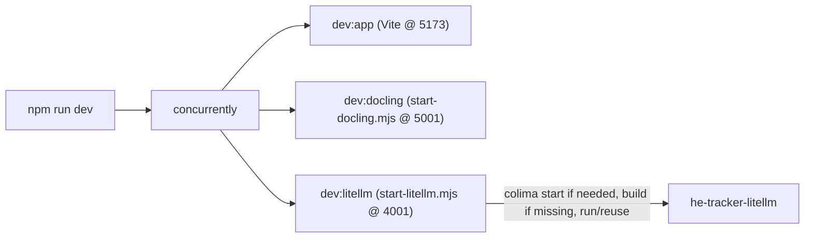

# PRP — Phase 19: Colima-Aware Auto-start of LiteLLM with the Dev Server

## Context

Phase 18 produced a self-hosted LiteLLM image + static config that runs on port **4001**. Phase 17 already auto-starts **Docling** alongside Vite via `concurrently` + `scripts/start-docling.mjs`. This phase does the same for LiteLLM so a single `npm run dev` brings up everything the app needs (Vite + Docling + LiteLLM).

The launcher mirrors `scripts/start-docling.mjs` but adds two things Docling didn't need:

- **Colima awareness** — this machine has no Docker Desktop. If the `docker` daemon isn't reachable, the launcher runs `colima start` and waits for the daemon before continuing (the manual step we previously had to do by hand).
- **Build-if-missing** — LiteLLM uses a locally built image (`he-tracker-litellm:latest`) rather than a public pull, so the launcher builds it once (with the Netskope CA build args from `.env.litellm`) if it's absent.



> As with Docling, `concurrently` is **not** run with `-k` (kill-others), so a missing runtime or absent `.env.litellm` never takes down Vite.

---

## Changes: `package.json`

Extend the `concurrently` dev script and add LiteLLM scripts (mirrors the Docling pattern):

```jsonc
"scripts": {
  "dev": "concurrently -n vite,docling,litellm -c cyan,green,magenta \"npm:dev:app\" \"npm:dev:docling\" \"npm:dev:litellm\"",
  "dev:app": "vite",
  "dev:docling": "node scripts/start-docling.mjs",
  "dev:litellm": "node scripts/start-litellm.mjs",
  "docling:stop": "node scripts/start-docling.mjs --stop",
  "litellm:stop": "node scripts/start-litellm.mjs --stop",
  "build": "tsc -b && vite build",
  "lint": "eslint .",
  "preview": "vite preview"
}
```

`concurrently` is already a dev dependency (added in Phase 17).

---

## New file: `scripts/start-litellm.mjs`

Node ESM launcher. Constants: `CONTAINER = 'he-tracker-litellm'`, `IMAGE = 'he-tracker-litellm:latest'`, `PORT = 4001` (maps to container `4000`), config path `litellm/litellm_config.yaml`, env file `.env.litellm`. Responsibilities:

- **Runtime + Colima**: pick `docker` (fallback `podman`). If `docker info` fails, attempt `colima start` and poll `docker info` until ready (bounded retries). If still unavailable, warn and idle so Vite keeps running.
- **Env guard**: if `.env.litellm` is missing, warn (`copy .env.litellm.example`) and idle — don't crash the dev server.
- **Build-if-missing**: if `docker images -q he-tracker-litellm:latest` is empty, build from `litellm/litellm.Dockerfile`, passing `NETSKOPE_ROOT_CA_B64` / `NETSKOPE_TENANT_CA_B64` read from `.env.litellm` as build args.
- **Reuse-if-running**: if `he-tracker-litellm` is already up, attach to its logs. If port 4001 is otherwise occupied, idle and assume available.
- **Run**: `run --rm --name he-tracker-litellm -p 4001:4000 --env-file .env.litellm -v <abs>/litellm/litellm_config.yaml:/app/config.yaml:ro he-tracker-litellm:latest --config /app/config.yaml --port 4000`.
- **Signals**: stop the container on `SIGINT`/`SIGTERM`; support `--stop`.

```js
import { spawn, spawnSync } from 'node:child_process'
import net from 'node:net'
import { existsSync, readFileSync } from 'node:fs'
import path from 'node:path'

const CONTAINER = 'he-tracker-litellm'
const IMAGE = 'he-tracker-litellm:latest'
const PORT = 4001
const ROOT = path.resolve(path.dirname(new URL(import.meta.url).pathname), '..')
const CONFIG = path.join(ROOT, 'litellm', 'litellm_config.yaml')
const DOCKERFILE = path.join(ROOT, 'litellm', 'litellm.Dockerfile')
const ENV_FILE = path.join(ROOT, '.env.litellm')

function pickRuntime() {
  for (const rt of ['docker', 'podman']) {
    const r = spawnSync(rt, ['--version'], { stdio: 'ignore' })
    if (!r.error && r.status === 0) return rt
  }
  return null
}

function daemonUp(rt) {
  return spawnSync(rt, ['info'], { stdio: 'ignore' }).status === 0
}

function ensureColima(rt) {
  if (daemonUp(rt)) return true
  if (spawnSync('colima', ['--version'], { stdio: 'ignore' }).status !== 0) return false
  console.log('[litellm] Docker daemon not reachable — starting Colima …')
  spawnSync('colima', ['start'], { stdio: 'inherit' })
  for (let i = 0; i < 30; i++) {
    if (daemonUp(rt)) return true
    spawnSync('sleep', ['2'])
  }
  return daemonUp(rt)
}

function readEnv() {
  const env = {}
  if (existsSync(ENV_FILE)) {
    for (const line of readFileSync(ENV_FILE, 'utf8').split('\n')) {
      const m = line.match(/^([A-Z0-9_]+)=(.*)$/)
      if (m) env[m[1]] = m[2]
    }
  }
  return env
}

function imageExists(rt) {
  const r = spawnSync(rt, ['images', '-q', IMAGE], { encoding: 'utf8' })
  return Boolean(r.stdout?.trim())
}

function buildImage(rt) {
  const env = readEnv()
  console.log(`[litellm] Building ${IMAGE} …`)
  const r = spawnSync(rt, [
    'build', '-f', DOCKERFILE,
    '--build-arg', `NETSKOPE_ROOT_CA_B64=${env.NETSKOPE_ROOT_CA_B64 ?? ''}`,
    '--build-arg', `NETSKOPE_TENANT_CA_B64=${env.NETSKOPE_TENANT_CA_B64 ?? ''}`,
    '-t', IMAGE, path.join(ROOT, 'litellm'),
  ], { stdio: 'inherit' })
  return r.status === 0
}

function isRunning(rt) {
  const r = spawnSync(rt, ['ps', '--filter', `name=^${CONTAINER}$`, '--format', '{{.Names}}'], { encoding: 'utf8' })
  return r.stdout?.trim() === CONTAINER
}

function stopContainer(rt) { spawnSync(rt, ['stop', CONTAINER], { stdio: 'ignore' }) }

function portInUse(port) {
  return new Promise((resolve) => {
    const s = net.connect({ host: '127.0.0.1', port })
    const done = (v) => { s.destroy(); resolve(v) }
    s.setTimeout(1000)
    s.once('connect', () => done(true))
    s.once('timeout', () => done(false))
    s.once('error', () => done(false))
  })
}

function idle() {
  process.stdin.resume()
  process.on('SIGINT', () => process.exit(0))
  process.on('SIGTERM', () => process.exit(0))
}

async function main() {
  const rt = pickRuntime()
  const stopMode = process.argv.includes('--stop')

  if (stopMode) { if (rt) { stopContainer(rt); console.log(`[litellm] Stopped ${CONTAINER}`) } process.exit(0) }

  if (!rt) { console.warn('[litellm] No docker/podman found — skipping LiteLLM. See docs/LITELLM.md.'); idle(); return }
  if (!ensureColima(rt)) { console.warn('[litellm] Docker daemon unavailable (Colima not started) — skipping LiteLLM.'); idle(); return }
  if (!existsSync(ENV_FILE)) { console.warn('[litellm] .env.litellm missing — copy .env.litellm.example. Skipping LiteLLM.'); idle(); return }

  if (isRunning(rt)) {
    console.log(`[litellm] ${CONTAINER} already running — attaching to logs.`)
    const c = spawn(rt, ['logs', '-f', CONTAINER], { stdio: 'inherit' })
    c.on('exit', (code) => process.exit(code ?? 0))
    return
  }
  if (await portInUse(PORT)) { console.log(`[litellm] Port ${PORT} already in use — using existing instance.`); idle(); return }

  if (!imageExists(rt) && !buildImage(rt)) { console.warn('[litellm] Image build failed — skipping LiteLLM.'); idle(); return }

  const onSignal = () => { stopContainer(rt); process.exit(0) }
  process.on('SIGINT', onSignal)
  process.on('SIGTERM', onSignal)

  console.log(`[litellm] Starting ${IMAGE} on http://localhost:${PORT} …`)
  const child = spawn(rt, [
    'run', '--rm', '--name', CONTAINER,
    '-p', `${PORT}:4000`,
    '--env-file', ENV_FILE,
    '-v', `${CONFIG}:/app/config.yaml:ro`,
    IMAGE, '--config', '/app/config.yaml', '--port', '4000',
  ], { stdio: 'inherit' })
  child.on('exit', (code) => process.exit(code ?? 0))
}

main()
```

> The Colima poll uses `spawnSync('sleep', …)` for simplicity; on Windows (no Colima) the daemon check just fails fast and the launcher idles, leaving Vite running.

---

## Files Modified

| File | Change |
|---|---|
| `package.json` | Add `litellm` pane to `dev`; add `dev:litellm` + `litellm:stop` |
| `scripts/start-litellm.mjs` | New — Colima-aware launcher (build-if-missing, reuse/idle, signal cleanup, `--stop`) |

No app source or schema changes.

---

## Verification

1. With `.env.litellm` present and Colima stopped: `npm run dev` starts Colima, builds the image on first run, then runs the container; the `litellm` prefixed logs show it listening on 4001. Vite and Docling come up in parallel.
2. `curl -s localhost:4001/health` succeeds without any manual container start.
3. Re-run `npm run dev` while the container is up — the launcher attaches to existing logs instead of failing on a port conflict.
4. Ctrl+C stops the container (`docker ps` no longer lists `he-tracker-litellm`); `npm run litellm:stop` also stops it.
5. With `.env.litellm` removed: `npm run dev` still starts Vite + Docling and prints the friendly "`.env.litellm` missing" warning (no crash).
6. `npm run dev:app` runs Vite only — unchanged.
