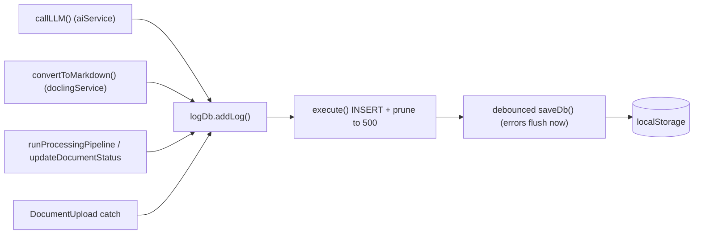

# PRP — Phase 22: Activity Log Infrastructure

## Context

When document processing fails, the only signal is a toast that auto-dismisses after 4 seconds (`src/components/Toast.tsx`), so the error message is gone before it can be read or copied. There is no record of what the AI pipeline did — which LLM calls were made, how long they took, what Docling returned, or why a document failed.

This phase adds a **persistent, capped activity log** that captures the key events across the ingestion pipeline. It is the data layer for the admin viewer built in Phase 23.

Design decisions:
- **Persist to SQLite, capped at ~500 newest rows, metadata only.** Full request/response bodies are intentionally NOT stored. This keeps the in-browser DB small — important because an oversized DB recently broke `saveDb()` (fixed by chunked base64 encoding, but bloat is still undesirable).
- **Debounced flush.** High-frequency LLM-call logs must not each trigger a full DB serialize, so writes are batched; errors flush immediately so a crash never loses the error row.



---

## Schema: `src/db/schema.ts`

Add an `app_logs` table (append to `SCHEMA_SQL`):

```sql
CREATE TABLE IF NOT EXISTS app_logs (
  id INTEGER PRIMARY KEY AUTOINCREMENT,
  ts TEXT NOT NULL DEFAULT (datetime('now')),
  level TEXT NOT NULL,                 -- 'info' | 'warn' | 'error'
  category TEXT NOT NULL,              -- 'llm' | 'docling' | 'pipeline' | 'upload' | 'system'
  message TEXT NOT NULL,
  document_id INTEGER,                 -- nullable; no FK so logs survive document deletion
  document_name TEXT,                  -- denormalized for display
  provider TEXT,                       -- 'azure' | 'litellm'  (llm only)
  model TEXT,                          -- model/deployment    (llm only)
  purpose TEXT,                        -- 'classify' | 'financials' | 'strategic' | 'sustainability' | 'keyFacts' | 'insights' | 'test'
  status_code INTEGER,                 -- HTTP status (llm/docling)
  duration_ms INTEGER,
  detail TEXT                          -- optional longer text (truncated ~2000 chars): error message + stack, etc.
);
```

> No foreign key on `document_id` on purpose — logs should outlive the documents they reference. `document_name` is denormalized so the viewer can label rows even after a document is deleted.

Per `CLAUDE.md`, update `docs/DATABASE.md`: add an `app_logs` entry to the table list with its columns and the "capped at 500 rows, metadata only" note.

---

## New file: `src/db/logDb.ts`

```ts
import { execute, query, saveDb } from './db'

export type LogLevel = 'info' | 'warn' | 'error'
export type LogCategory = 'llm' | 'docling' | 'pipeline' | 'upload' | 'system'

export interface LogInput {
  level: LogLevel
  category: LogCategory
  message: string
  documentId?: number | null
  documentName?: string | null
  provider?: string | null
  model?: string | null
  purpose?: string | null
  statusCode?: number | null
  durationMs?: number | null
  detail?: string | null
}

export interface LogRow extends LogInput {
  id: number
  ts: string
}

const MAX_ROWS = 500
const DETAIL_MAX = 2000
const FLUSH_DELAY_MS = 1500

let flushTimer: ReturnType<typeof setTimeout> | null = null
function scheduleFlush(immediate: boolean) {
  if (immediate) {
    if (flushTimer) { clearTimeout(flushTimer); flushTimer = null }
    saveDb()
    return
  }
  if (flushTimer) return
  flushTimer = setTimeout(() => { flushTimer = null; saveDb() }, FLUSH_DELAY_MS)
}

export function addLog(input: LogInput): void {
  const detail = input.detail ? input.detail.slice(0, DETAIL_MAX) : null
  try {
    execute(
      `INSERT INTO app_logs
        (level, category, message, document_id, document_name, provider, model, purpose, status_code, duration_ms, detail)
       VALUES (?,?,?,?,?,?,?,?,?,?,?)`,
      [
        input.level, input.category, input.message,
        input.documentId ?? null, input.documentName ?? null,
        input.provider ?? null, input.model ?? null, input.purpose ?? null,
        input.statusCode ?? null, input.durationMs ?? null, detail,
      ]
    )
    execute(
      `DELETE FROM app_logs WHERE id NOT IN (SELECT id FROM app_logs ORDER BY id DESC LIMIT ?)`,
      [MAX_ROWS]
    )
    scheduleFlush(input.level === 'error')
  } catch {
    // Logging must never throw into the caller's pipeline.
  }
}

export interface LogFilter {
  level?: LogLevel
  category?: LogCategory
  search?: string
  documentId?: number
  limit?: number
}

export function getLogs(filter: LogFilter = {}): LogRow[] {
  const where: string[] = []
  const params: (string | number)[] = []
  if (filter.level) { where.push('level = ?'); params.push(filter.level) }
  if (filter.category) { where.push('category = ?'); params.push(filter.category) }
  if (filter.documentId != null) { where.push('document_id = ?'); params.push(filter.documentId) }
  if (filter.search) { where.push('(message LIKE ? OR detail LIKE ?)'); params.push(`%${filter.search}%`, `%${filter.search}%`) }
  const clause = where.length ? `WHERE ${where.join(' AND ')}` : ''
  params.push(filter.limit ?? MAX_ROWS)
  return query<LogRow>(`SELECT * FROM app_logs ${clause} ORDER BY id DESC LIMIT ?`, params)
}

export function clearLogs(): void {
  execute('DELETE FROM app_logs')
  saveDb()
}
```

---

## Instrumentation

### 1. `callLLM()` — `src/services/aiService.ts`

Add an optional `meta` to thread context, and log each request outcome. Logging wraps the existing retry loop; it must not change behavior.

```ts
type LLMMeta = { purpose?: string; documentId?: number | null; documentName?: string | null }

async function callLLM(
  messages: { role: 'system' | 'user' | 'assistant'; content: string }[],
  options?: { jsonMode?: boolean; temperature?: number; maxTokens?: number; meta?: LLMMeta }
): Promise<string> {
  // ...existing url/headers/body setup, capturing `provider` and `model`...
  const started = performance.now()
  for (let attempt = 0; attempt < 4; attempt++) {
    if (attempt > 0) await new Promise((r) => setTimeout(r, 10000))
    try {
      const resp = await fetch(url, { method: 'POST', headers, body: JSON.stringify(body) })
      if (resp.status === 429) {
        addLog({ level: 'warn', category: 'llm', message: 'Rate limited (429), retrying', provider, model, purpose: options?.meta?.purpose, statusCode: 429, durationMs: Math.round(performance.now() - started), documentId: options?.meta?.documentId, documentName: options?.meta?.documentName })
        lastError = new Error('Rate limited (429). Retrying…'); continue
      }
      if (!resp.ok) {
        addLog({ level: 'error', category: 'llm', message: `LLM error ${resp.status} ${resp.statusText}`, provider, model, purpose: options?.meta?.purpose, statusCode: resp.status, durationMs: Math.round(performance.now() - started), documentId: options?.meta?.documentId, documentName: options?.meta?.documentName })
        throw new Error(`LLM error: ${resp.status} ${resp.statusText}`)
      }
      const data = await resp.json() as { choices: { message: { content: string } }[] }
      addLog({ level: 'info', category: 'llm', message: `${options?.meta?.purpose ?? 'completion'} ok`, provider, model, purpose: options?.meta?.purpose, statusCode: 200, durationMs: Math.round(performance.now() - started), documentId: options?.meta?.documentId, documentName: options?.meta?.documentName })
      return data.choices[0].message.content
    } catch (e) {
      if (attempt === 3) {
        addLog({ level: 'error', category: 'llm', message: `LLM request failed: ${e instanceof Error ? e.message : String(e)}`, provider, model, purpose: options?.meta?.purpose, durationMs: Math.round(performance.now() - started), documentId: options?.meta?.documentId, documentName: options?.meta?.documentName, detail: e instanceof Error ? e.stack : undefined })
      }
      lastError = e instanceof Error ? e : new Error(String(e))
    }
  }
  throw lastError ?? new Error('LLM request failed after retries')
}
```

- Each exported caller passes a `purpose`: `classifyDocument` → `'classify'`, `extractFinancials` → `'financials'`, `extractStrategicPriorities` → `'strategic'`, `extractSustainability` → `'sustainability'`, `extractKeyFacts` → `'keyFacts'`, `generateInsights` → `'insights'`, `testConnection` → `'test'`.
- Document context (`documentId`/`documentName`) is supplied by the pipeline. Simplest approach: a module-level "current document" set/cleared by `runProcessingPipeline` via a small exported setter (`setLogContext(doc | null)`) in `logDb.ts` that `callLLM` reads as a default when `meta` omits them. Either threading or ambient context is acceptable; pick one and keep it consistent.

### 2. `convertToMarkdown()` — `src/services/doclingService.ts`

Log start, success (status, duration, word count), and each failure branch (unreachable, timeout, non-OK, empty markdown) with the file name and size:

```ts
const started = performance.now()
addLog({ level: 'info', category: 'docling', message: `Converting ${file.name}`, documentName: file.name })
// on success:
addLog({ level: 'info', category: 'docling', message: `Converted ${file.name} (${wordCount} words)`, documentName: file.name, statusCode: 200, durationMs: Math.round(performance.now() - started) })
// on each throw: addLog({ level: 'error', category: 'docling', message: <error>, documentName: file.name, durationMs: ... })
```

### 3. `runProcessingPipeline()` — `src/services/processingPipeline.ts`

- At start, set the log document context.
- Log terminal outcomes: on success `addLog({ level:'info', category:'pipeline', message:'processed', documentId, documentName })`; in the catch, `addLog({ level:'error', category:'pipeline', message, documentId, documentName, detail: err.stack })` before re-throwing.
- Optionally log each `onStepChange` transition at `info`.

### 4. `DocumentUpload` catch block — `src/components/DocumentUpload.tsx`

Alongside the existing `updateDocumentStatus(...)` + `showToast('error', ...)`, add:

```ts
addLog({ level: 'error', category: 'upload', message: `Failed to process ${file.name}: ${msg}`, documentName: file.name, documentId: docId ?? undefined, detail: err instanceof Error ? err.stack : undefined })
```

This guarantees the failure is captured persistently even after the toast disappears.

---

## Files Modified

| File | Change |
|---|---|
| `src/db/schema.ts` | Add `app_logs` table |
| `docs/DATABASE.md` | Document `app_logs` (columns + capped/metadata note) |
| `src/db/logDb.ts` | New — `addLog`, `getLogs`, `clearLogs`, debounced flush, 500-row cap, optional log context |
| `src/services/aiService.ts` | Instrument `callLLM`; thread `purpose`/doc context from callers |
| `src/services/doclingService.ts` | Instrument `convertToMarkdown` |
| `src/services/processingPipeline.ts` | Set log context; log terminal success/failure |
| `src/components/DocumentUpload.tsx` | Add error log in the catch block |

---

## Verification

1. `npm run build` — no TypeScript errors.
2. Process a document end to end; query `app_logs` (or use the Phase 23 viewer) and confirm rows for: Docling convert, classify, each extraction call, and pipeline `processed`.
3. Force a failure (wrong LiteLLM key, or stop the proxy / Docling) and confirm an `error` row with the full message; confirm the matching toast still appears.
4. Generate >500 log entries and confirm the table stays capped at 500 (oldest pruned).
5. Reload the page and confirm recent logs persist (debounced flush wrote them); confirm rapid LLM-call logging does not cause visible UI stalls.
