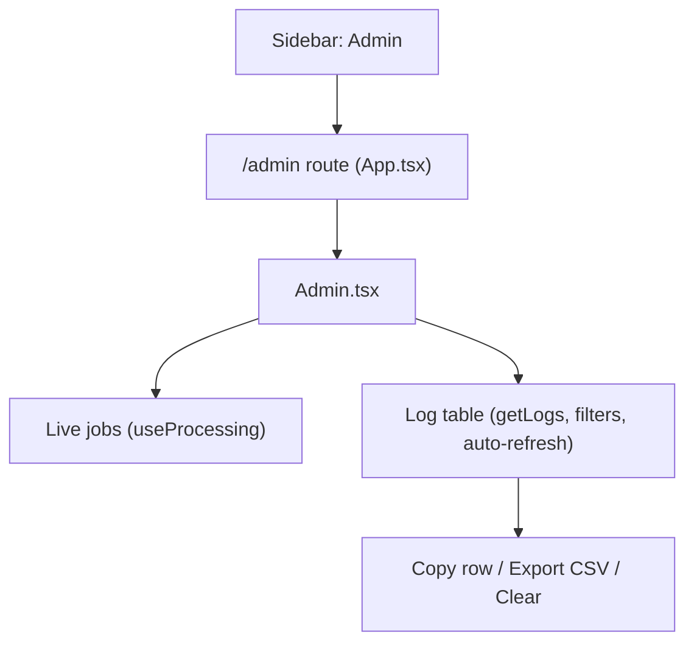

# PRP — Phase 23: Admin Logs Viewer

## Context

Phase 22 captures pipeline activity into the `app_logs` table. This phase surfaces it in a dedicated **Admin** view so a user can watch processing live and inspect/copy past errors after the fact — directly solving the "the error toast disappears before I can copy it" problem.

No schema changes. This is UI plus routing/navigation, reading via `getLogs()`/`clearLogs()` from `src/db/logDb.ts` (Phase 22) and live jobs from `useProcessing()`.



---

## Routing and navigation

### `src/App.tsx`

Add the route inside the `<Route path="/" element={<Layout />}>` group:

```tsx
import Admin from './pages/Admin'
// ...
<Route path="/admin" element={<Admin />} />
```

### `src/components/Layout.tsx`

Add a nav item to `NAV_ITEMS` (import an icon such as `ScrollText` from `lucide-react`):

```tsx
const NAV_ITEMS = [
  { to: '/dashboard', label: 'Dashboard', icon: LayoutDashboard },
  { to: '/institutions', label: 'Institutions', icon: Building2 },
  { to: '/documents', label: 'Documents', icon: FileText },
  { to: '/analysis', label: 'Analysis', icon: BarChart2 },
  { to: '/admin', label: 'Admin', icon: ScrollText },
  { to: '/settings', label: 'Settings', icon: Settings },
]
```

---

## New page: `src/pages/Admin.tsx`

### Live section (top)

Read in-flight jobs from `useProcessing()` (the same `jobs` the `ProcessingStatusBar` uses). For each job show file name, current step (reuse the `STEP_LABELS` mapping from `ProcessingStatusBar`), progress, and any `error`. When there are no active jobs, show a muted "No active processing" line.

### Log table

- Source: `getLogs(filter)` (newest first; already capped/limited).
- Columns: **Time** (`ts`, localized), **Level** (color badge: info=slate/blue, warn=amber, error=red), **Category** (`llm`/`docling`/`pipeline`/`upload`/`system`), **Document** (`document_name`), **Message**.
- Expandable row: clicking a row reveals `detail` plus the metadata fields — `provider`, `model`, `purpose`, `status_code`, `duration_ms`. This is where a full error message/stack is read.

### Filters

A control bar above the table:
- Level dropdown: All / info / warn / error.
- Category dropdown: All / llm / docling / pipeline / upload / system.
- Free-text search box (matches `message`/`detail`, passed as `filter.search`).
- All filters are passed into `getLogs()` so filtering happens in SQL.

### Auto-refresh

- Poll `getLogs(filter)` on an interval (~3s) via `setInterval` in a `useEffect`, cleared on unmount and re-created when filters change.
- A manual **Refresh** button for immediate reload.
- Pause polling while a row is expanded is optional; simplest is to keep polling and preserve the expanded id across refreshes.

### Actions (the copy fix)

- **Per-row Copy**: copies a formatted single-line/multi-line string (timestamp, level, category, document, message, and detail) to the clipboard via `navigator.clipboard.writeText`; confirm with a success toast (`useToast`).
- **Export CSV**: reuse `downloadCsv(filename, rows)` from `src/utils/exportCsv.ts` to export the currently filtered logs as `activity_logs_{date}.csv`. Show an error toast if there are no rows (matches the existing CSV-empty pattern).
- **Clear Logs**: a button that opens the existing `ConfirmDialog`; on confirm calls `clearLogs()` and reloads. Warn that this is irreversible.

### UX notes

- Reuse existing primitives: `ConfirmDialog`, `useToast`, Tailwind table/badge styles already used elsewhere (e.g. the Documents list).
- Empty state: "No logs yet. Process a document to see activity here."
- Keep it readable on narrow screens (horizontal scroll on the table, consistent with `Phase 8.1`).

---

## Files Modified

| File | Change |
|---|---|
| `src/App.tsx` | Add `/admin` route |
| `src/components/Layout.tsx` | Add "Admin" nav item (+ icon import) |
| `src/pages/Admin.tsx` | New — live jobs section + filterable, auto-refreshing log table with per-row copy, CSV export, and clear |

No schema changes (reads Phase 22's `app_logs` via `logDb.ts`).

---

## Verification

1. `npm run build` — no TypeScript errors; "Admin" appears in the sidebar and routes to `/admin`.
2. Start processing a document and watch the **Live** section update through the steps; new log rows appear within ~3s without a manual reload.
3. Filter to **error**, expand a failed row, and confirm the full error message/stack is visible and the **Copy** button puts it on the clipboard.
4. **Export CSV** downloads the filtered rows; exporting with no rows shows the empty-data toast.
5. **Clear Logs** (after confirm) empties the table; reload confirms it persisted.
6. Trigger a known failure (wrong LiteLLM key) and confirm the error is now inspectable here even minutes later — no longer dependent on catching the 4s toast.
